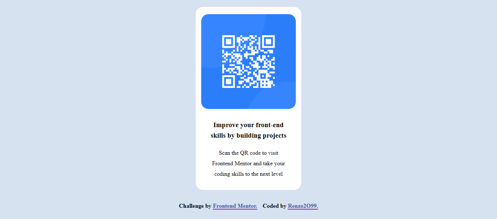

# Frontend Mentor - QR Code Component

Esta es una solución al [desafío del componente de código QR en Frontend Mentor](https://www.frontendmentor.io/challenges/qr-code-component-iux_sIO_H). Los desafíos de Frontend Mentor te ayudan a mejorar tus habilidades de codificación al construir proyectos realistas.

## Tabla de contenidos

- [Descripción general](#descripción-general)
  - [Captura de pantalla](#captura-de-pantalla)
  - [Enlaces](#enlaces)
- [Mi proceso](#mi-proceso)
  - [Construido con](#construido-con)
  - [Lo que aprendí](#lo-que-aprendí)
  - [Desarrollo continuo](#desarrollo-continuo)
  - [Recursos útiles](#recursos-útiles)
- [Autor](#autor)
- [Agradecimientos](#agradecimientos)

## Descripción general

### Captura de pantalla

### Links

- Live Site URL: [QR Code Component](https://renzo2o99.github.io/qr-code-component-main/)

## Mi Proceso

### Construido con

- Marcado HTML5 semántico.
- Propiedades personalizadas de CSS.
- CSS Flexbox.
- CSS Grid.
- Flujo de trabajo Mobile-First.

### Lo que aprendí

Puse en práctica mis habilidades en HTML 5 y CSS 3, además de implementar la metodología Mobile First para el desarrollo del sitio y el uso de CSS Flexbox y CSS Grid.

## Author

- GitHub User - [@Renzo2O99](https://github.com/Renzo2O99)
- Frontend Mentor User - [@Renzo2O99](https://www.frontendmentor.io/profile/Renzo2O99)
# Frontend Mentor - QR Code Component
